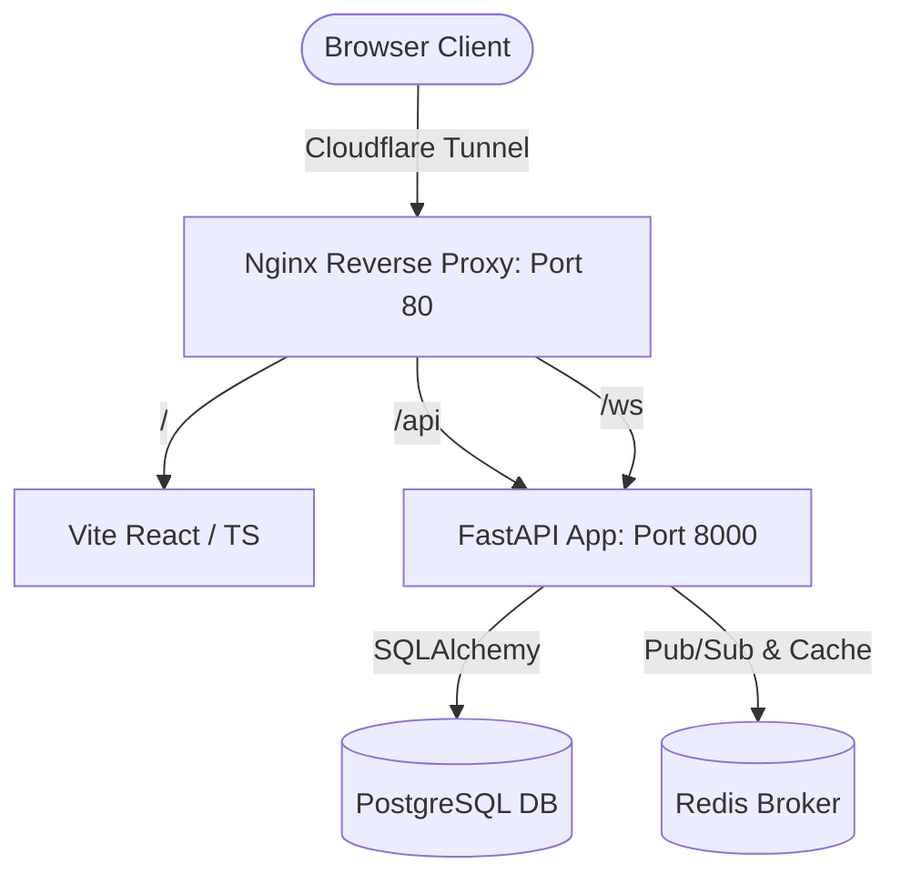

# GuildPing: Real-time WoW Recruitment Platform

GuildPing is a production-ready, real-time World of Warcraft recruitment platform designed to solve delayed communication between player raiders and guild recruiters. It allows players to list characters (with class, spec, goals, and JSON-based weekly availability schedules) and lets recruiters post guild profiles (specifying progression, raid times, and current recruitment needs). Once mutual interest is expressed, a **Match** is generated instantly, unlocking a real-time secure chat room.

---

## Architecture & Tech Stack

GuildPing is designed as a multi-container Docker Compose application configured to run securely behind a reverse proxy and optionally a Cloudflare Tunnel:



### Stack Components
- **Frontend**: Single Page Application built using React, TypeScript, Vite, Tailwind CSS, Lucide icons, and TanStack Query. Served via a lightweight Nginx image.
- **Backend**: FastAPI (Python 3.12) running under Uvicorn. Uses standard SQLAlchemy for transactions, Alembic for migrations, and passlib (bcrypt) + JWT for user authentication.
- **Database**: PostgreSQL (relational storage for users, profiles, matches, messages, and notifications).
- **Pub/Sub Cache**: Redis (assists cache validation and supports connection manager signaling).
- **Reverse Proxy**: Nginx (routes all incoming requests: `/` to frontend, `/api` to backend, `/ws` to WebSocket upgrade gateways).

---

## Directory Structure

```
GuildPing/
├── docker-compose.yml       # Production/development multi-container docker setup
├── .env.example             # Configuration variables blueprint
├── nginx/
│   ├── nginx.conf           # Global Nginx server configuration
│   └── conf.d/
│       └── guildping.conf   # Route-splitting reverse proxy setup (frontend, api, ws)
├── backend/
│   ├── Dockerfile           # Thin Python 3.12 backend image definition
│   ├── requirements.txt     # Python package requirements
│   ├── alembic.ini          # Database migration configurations
│   ├── alembic/             # Migration versions directory
│   └── app/
│       ├── main.py          # FastAPI application initialization & route mapping
│       ├── core/
│       │   ├── config.py    # Pydantic BaseSettings environment mappings
│       │   ├── security.py  # Hashing, verifying, and JWT token signatures
│       │   └── logging.py   # Custom JSON structured logging setup
│       ├── db/
│       │   ├── session.py   # Connection pool, engine, and get_db session dependency
│       │   └── base.py      # Declarative base model tracking
│       ├── models/          # Declarative SQLAlchemy models (User, PlayerProfile, GuildProfile, etc.)
│       ├── schemas/         # Pydantic schemas for request validation & response serialization
│       ├── api/             # Routers for auth, profiles, matches, and notifications
│       ├── websocket/       # WebSocket server router & connection manager
│       └── seed.py          # Script to populate Postgres with sample data
└── frontend/
    ├── Dockerfile           # Multi-stage production React builder
    ├── nginx.conf           # Internal static serving configuration
    ├── package.json         # Node package manager declarations
    ├── tailwind.config.js   # Tailored theme accents & dark-mode configurations
    └── src/
        ├── App.tsx          # Main entry points, global layouts, and WebSocket listeners
        ├── main.tsx         # Root DOM renderer
        ├── index.css        # Core styling tokens & animations
        └── pages/           # UI views (Landing, Dashboard, Login, Edit Profiles, Chat, Search)
```

---

## Deployment & Running Locally

### 1. Prerequisites
- [Docker](https://www.docker.com/products/docker-desktop) and Docker Compose installed.

### 2. Environment Setup
Copy the example environment file and configure variables:
```bash
cp .env.example .env
```
Ensure DB credentials, JWT secrets, and ports align with your local host environment.

### 3. Build & Run Containers
Start the services in detached mode:
```bash
docker compose up -d --build
```
This command compiles the React assets, downloads images for Postgres and Redis, and starts the FastAPI server.

Verify all containers are running successfully:
```bash
docker compose ps
```

### 4. Database Migrations
Initialize database tables using Alembic:
```bash
docker compose exec backend alembic upgrade head
```

### 5. Seed Sample Data
Populate the database with three demo users, raid listings, matches, and message logs:
```bash
docker compose exec backend python app/seed.py
```

After seeding, you can test authentication using these credentials:
* **Recruiter**: `recruiter@guildping.com` / `password123`
* **Player 1**: `player1@guildping.com` / `password123`
* **Player 2**: `player2@guildping.com` / `password123`

### 6. Verify Health Checks
To confirm backend connects to the databases, run a curl request on the health endpoint:
```bash
curl http://localhost:8080/api/health
```
Expected output:
```json
{"status":"ok","postgres":"connected","redis":"connected"}
```
You can access the UI directly via `http://localhost:8080`.

---

## Cloudflare Tunnel Setup (Opt-in)

The `docker-compose.yml` includes a commented-out `cloudflared` container configuration. To run behind a Cloudflare Tunnel:
1. Open your Cloudflare Zero Trust Dashboard and create a new Tunnel.
2. In the `.env` file, populate `CLOUDFLARE_TUNNEL_TOKEN` with your tunnel token.
3. Configure the public hostname in Cloudflare to route traffic for your domain (e.g. `guildping.com`) to `http://nginx:80` (or `http://localhost:8080` internally).
4. Uncomment the `cloudflared` service blocks inside your `docker-compose.yml`.
5. Restart your containers using `docker compose up -d`. No public ports 80/443 need to be exposed on your server.

---

## Logging, Auditing & Troubleshooting

### Structured Backend Logs
All core backend operations are logged in a structured format by the logger initialized in `app/core/logging.py`.
- Logs include operation details (e.g. connection manager registration, JWT validations, database queries, and interest matching).
- Inspect logs in real-time using:
  ```bash
  docker compose logs -f backend
  ```

### Troubleshooting Common Errors

#### 1. Database Connection Failures
* **Symptom**: Health checks fail, or logs report `psycopg.OperationalError: Connection refused`.
* **Fix**: Ensure the `postgres` service is fully healthy. Check logs via `docker compose logs postgres`. Ensure `DATABASE_URL` in `.env` targets host `postgres` (the Docker network service name) rather than `localhost` or `127.0.0.1`.

#### 2. Redis Connection Issues
* **Symptom**: Logs show `redis.exceptions.ConnectionError`.
* **Fix**: Validate that `REDIS_URL` uses the format `redis://redis:6379/0`. Confirm the `redis` container is up and running.

#### 3. WebSocket Disconnections
* **Symptom**: Console prints `WebSocket connection closed`.
* **Fix**: Nginx configures reverse proxies with standard header upgrades. Check that your local client is attempting connection via path `/ws?token=JWT_TOKEN`. Make sure Nginx configurations in `nginx/conf.d/guildping.conf` contain:
  ```nginx
  proxy_set_header Upgrade $http_upgrade;
  proxy_set_header Connection "upgrade";
  ```
